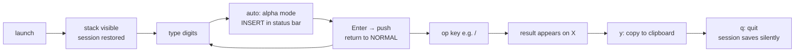
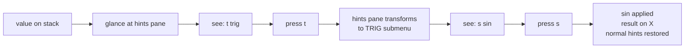
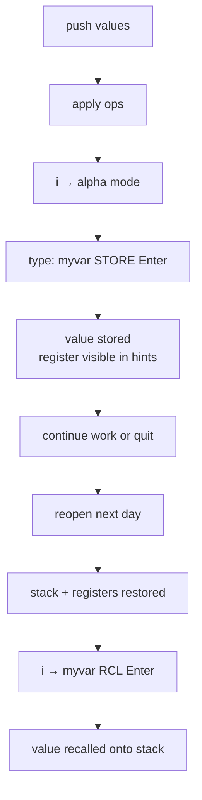
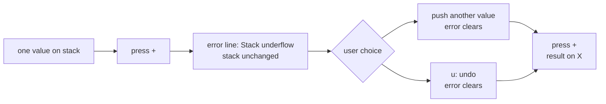

# UX Design Specification - rpncalc

**Author:** Boss
**Date:** 2026-03-18

---

<!-- UX design content will be appended sequentially through collaborative workflow steps -->

## Executive Summary

### Project Vision

rpncalc is a keyboard-native RPN calculator for CLI power users. Discoverability is the product — the hints pane functions as a live tutorial and session assistant, eliminating the need for any external documentation. Every design decision serves the 30-second session goal.

### Target Users

Single technical user: CLI power user, terminal-native, fast typist. Values speed for common tasks and discoverability for rare ones. No mouse. No menus. No manual.

### Key Design Challenges

- Hints pane: context-sensitive, always relevant, never overwhelming — the product promise lives here
- Input model: multi-token commands (e.g., `r1 RCL`) need clear feedback and partial-input behavior
- Terminal layout: HP 48-inspired design must adapt gracefully to varying terminal dimensions

### Design Opportunities

- Hints pane as live session assistant: surfaces named registers and session state alongside static operations
- Status bar as zero-effort orientation: mode, base, and representation style always visible
- Live input filtering: hints narrow as the user types, reducing cognitive load

## Core User Experience

### Defining Experience

The core loop: push values onto the stack, apply operations, results appear immediately. Every session targets completion in under 30 seconds. The interaction model is vi-inspired modal design — familiar to CLI power users, zero learning curve for the target audience.

### Platform Strategy

- **Platform:** Terminal TUI, keyboard-only, single Rust binary
- **Input:** Keyboard exclusively — no mouse, no touch
- **Terminal compatibility:** Standard ANSI/VT100; layout adapts to terminal dimensions
- **No scripting mode:** Interactive-only by design

### Interaction Model: Two Modes

**Normal Mode** (default — like vi normal):

Single keys and chords execute immediately. No Enter required.

| Key(s) | Action |
|---|---|
| `s` `d` `p` `r` `n` | swap, drop, dup, rotate, negate |
| `u` / `Ctrl-R` | undo / redo |
| `y` | yank top-of-stack to clipboard |
| `+` `-` `*` `/` `^` `%` `!` | immediate binary/unary math ops |
| `Enter` | dup (HP convention: Enter with empty buffer = duplicate X) |
| `q` | quit |
| `i` or any digit | enter alpha mode |

**Chord leaders** (press leader → hints pane shows submenu → press second key):

| Leader | Category | Bindings |
|---|---|---|
| `t` | Trig | `s`=sin `c`=cos `a`=tan `S`=asin `C`=acos `A`=atan |
| `l` | Log/Exp | `l`=ln `L`=log10 `e`=exp `E`=exp10 |
| `f` | Functions | `s`=sqrt `q`=sq `r`=recip `a`=abs |
| `c` | Constants | `p`=π `e`=e `g`=φ |
| `m` | Angle mode | `d`=DEG `r`=RAD `g`=GRAD |
| `x` | Base/Style | `c`=DEC `h`=HEX `o`=OCT `b`=BIN |
| `X` | Hex style | `c`=0xFF `a`=$FF `s`=#FF `i`=FFh |

**Alpha Mode** (entered with `i` or any digit — like vi insert):

Full text input for numbers, command words, and register operations.

| Key | Action |
|---|---|
| digits / `.` / `e` / `0x`... | build number |
| letters | build command word |
| `Enter` | push number or execute command → return to normal mode |
| `Esc` | cancel / clear buffer → return to normal mode |

Alpha mode examples:
- `3.14` `Enter` → push 3.14 (digit auto-triggers alpha mode — no `i` needed)
- `i` `r1 RCL` `Enter` → recall register r1 (use `i` to start with a letter)
- `i` `myvar STORE` `Enter` → store top-of-stack as myvar

### Effortless Interactions

- **Number entry:** press any digit → auto-enters alpha mode → type → Enter
- **Basic arithmetic:** `3` `Enter` `4` `Enter` `+` — 5 keystrokes total
- **Undo:** `u` — 1 keystroke, instant, no confirmation
- **Clipboard:** `y` — 1 keystroke
- **Quit:** `q` — 1 keystroke, no confirmation
- **Find a rare op:** glance at hints pane, press chord

### Critical Success Moments

1. **First operation succeeds** — user types digits, Enter, digits, Enter, `+` and gets a result immediately
2. **Chord discovery** — user presses `t`, hints pane shows trig submenu, presses `s`, sin executes — never needed a manual
3. **Error recovery** — user presses `u`, stack rewinds cleanly — feels safe to experiment
4. **Register persistence** — user reopens rpncalc next day, named registers are still there

### Experience Principles

1. **Keystrokes are sacred** — no confirmation on reversible actions; common ops ≤ 2 keystrokes
2. **The stack is always the truth** — complete state visible at all times, no hidden context
3. **Errors inform, never block** — feedback in status line, clears automatically, stack never corrupted
4. **Hints are ambient, not modal** — always present, rewards glancing, demands nothing; chord-aware (shows submenu after leader key)
5. **Mode is always visible** — status bar shows `[NORMAL]` / `[INSERT]` + active angle mode + active base at all times

## Desired Emotional Response

### Primary Emotional Goals

**Mastery** is the primary emotional target. rpncalc should feel like a finely tuned instrument that responds to expert intent — the user is in command, the tool never fights back. Every interaction should reinforce the feeling that the user is skilled, not that the tool is complex.

**Flow** is the secondary goal. The 30-second session should disappear into the surrounding work. The calculator never interrupts thought, never asks for confirmation on reversible actions, never interposes itself between the user and the result.

### Emotional Journey Mapping

| Stage | Target Emotion | What delivers it |
|---|---|---|
| First launch | Orientation without anxiety | Stack visible immediately; hints pane shows what to do next |
| First calculation | Satisfaction and confidence | Keystrokes work exactly as expected; result appears instantly |
| Chord discovery | Delight | Pressed `t`, submenu appeared — found sin without a manual |
| Error / wrong input | Calm recovery | Status line shows what went wrong; `u` rewinds cleanly; stack intact |
| Session end | Quiet trust | Named registers will be there tomorrow; nothing to save manually |
| Return session | Recognition | Registers and stack restored — the tool remembers |

### Micro-Emotions

- **Confidence over confusion** — mode always visible in status bar; no mystery about what a keystroke will do
- **Trust over skepticism** — full-state undo means every operation is reversible; users experiment freely
- **Satisfaction over frustration** — common ops in 1-2 keystrokes; rare ops discoverable in ≤5 seconds via hints
- **Calm over anxiety** — session persistence is silent and automatic; atomic writes mean no data loss
- **Curiosity over avoidance** — hints pane rewards exploration; pressing a chord leader reveals a submenu, not an error

### Design Implications

| Desired Emotion | UX Design Choice |
|---|---|
| Mastery | Single-key ops for common actions; no friction on reversible operations |
| Flow | No confirmation dialogs; status feedback clears automatically; 30-second session path is unobstructed |
| Calm confidence | Undo always available (`u`); stack never corrupted by errors; status bar always shows current state |
| Delight on discovery | Chord leader reveals submenu in hints pane — exploration is rewarded visually |
| Trust in persistence | Silent session save on exit; atomic writes; registers restored on next launch without user action |
| Recovery without frustration | Errors shown in status line, not as blocking dialogs; stack unchanged after error; `u` always rewinds |

### Emotional Design Principles

1. **Never punish curiosity** — pressing an unknown key shows what it does (via hints) or produces a recoverable error, never data loss
2. **Confidence through visibility** — the full stack is always on screen; the current mode is always in the status bar; nothing is hidden
3. **Undo as emotional safety net** — the existence of full-state undo changes how users interact: they explore boldly because they know they can return
4. **Silence is trust** — session persistence, atomic writes, and register retention happen silently; no "save?" prompts, no confirmation noise
5. **Speed is respect** — sub-50ms keypress response and sub-500ms startup signal that the tool values the user's time as much as they do

## UX Pattern Analysis & Inspiration

### Inspiring Products Analysis

| Product | What it contributes |
|---|---|
| **Helix / Zellij** | Context-sensitive keybinding display — the direct model for the hints pane; chord leaders with live submenu feedback after the leader key is pressed |
| **vi / neovim** | Modal design (normal/insert split), mnemonic single-key assignments, zero-friction common operations, `u` for undo |
| **HP 48** | RPN stack display conventions (most-recent at top, numbered rows), immediate visual feedback, the calculator-as-instrument aesthetic |
| **orpie** | Closest prior art in terminal RPN — proof of concept for the niche; abandoned, no discoverability, no undo; rpncalc is the modern replacement |
| **dc** | Proof that RPN in a terminal is useful and used; cryptic and line-based — the anti-model for discoverability |

### Transferable UX Patterns

**Hints pane (from Helix/Zellij):**
- Always-visible keybinding display that updates with calculator state
- Chord-aware: pressing a leader key transforms the hints pane into a category submenu in real time
- Grouped by category (trig, log, stack ops, constants) — same approach as Helix's which-key display

**Modal input (from vi):**
- Normal mode for immediate single-key actions; alpha/insert mode for text entry
- `Esc` always returns to normal; mode always visible in status bar
- Mnemonic key assignments: `s`=swap, `d`=drop, `p`=dup, `u`=undo, `y`=yank

**Stack display (from HP 48):**
- Stack grows upward; most-recent value at bottom of stack pane (X register)
- Numbered stack rows; values displayed in current base/representation
- Input line below stack, status bar at bottom

### Anti-Patterns to Avoid

- **dc-style opacity** — no hints, no feedback, entire interface requires manual recall; users must memorize or look up commands externally
- **Modal traps** — unclear what mode you're in; rpncalc counters this with permanent `[NORMAL]`/`[INSERT]` status bar indicator
- **Confirmation dialogs on reversible actions** — undo exists; asking "are you sure?" on drop/clear is friction; never prompt for reversible operations
- **Documentation dependency** — if the user needs a man page to do basic operations, the hints pane has failed; every MVP operation must be discoverable in-app
- **Error as blocker** — errors that halt interaction or require acknowledgment; rpncalc errors show in status line and clear automatically, stack unchanged

### Design Inspiration Strategy

**Adopt directly:**
- Helix-style hints pane: always visible, chord-aware, state-sensitive
- vi modal split: normal mode for ops, alpha mode for text/numbers
- HP 48 stack layout conventions

**Adapt for terminal constraints:**
- HP 48 visual density → simplified ASCII/Unicode layout that works in any terminal width
- Helix's floating which-key popup → integrated hints pane (no overlay, always present)

**Deliberately avoid:**
- orpie's full-screen menu overlays — breaks flow
- dc's stateless prompt — no visible state, no discoverability
- Any pattern requiring mouse interaction

## Design System Foundation

### Design System Choice

**Custom TUI design system built on ratatui primitives.** No external component library. Every widget is defined explicitly using ratatui's layout, block, and style primitives.

### Rationale for Selection

- ratatui gives full pixel-level control — required to achieve the specific HP48-inspired layout with hints pane
- Terminal TUI component libraries (tui-realm, etc.) impose layout conventions that conflict with the rpncalc design
- The instrument aesthetic requires crafted visual grammar, not templated widgets
- Solo developer + AI: a well-specified custom system is faster than fighting an opinionated library
- The "design system" for a TUI is primarily the layout spec and visual grammar — both must be owned

### Implementation Approach

ratatui's constraint-based layout system (Flex, Direction, Constraint) handles responsive terminal sizing. Custom widget implementations for:
- Stack pane (scrollable list with row numbers)
- Input line (single-row text buffer with cursor)
- Hints pane (categorized keybinding grid, chord-aware)
- Status bar (fixed-height, always visible)

### Customization Strategy

**Design tokens (defined as Rust constants):**

| Token | Purpose |
|---|---|
| Color roles | Stack values, active input, hints text, error state, mode indicators |
| Border styles | Stack pane gets border; hints pane borderless or minimal; status bar separator line |
| Layout proportions | Stack pane / hints pane split ratio; minimum terminal dimensions |
| Density defaults | Visible stack rows (fills available height); hints columns (2–3 per category) |

**Visual grammar rules:**
- Monospace alignment: values right-aligned in stack pane; hints left-aligned in grid
- Truncation: long register names truncated with `…`; stack values truncated at column width
- Error state: status bar text changes color (red/yellow); no border change, no layout shift
- Chord state: hints pane header changes to show active leader category; normal content replaced by submenu

## Visual Design Foundation

### Color System

No hardcoded RGB values. Colors are expressed as terminal semantic roles, resolved at render time against the user's active terminal palette. This respects user terminal themes and avoids imposing a color scheme the user hasn't chosen.

| Role | Semantic color | Used for |
|---|---|---|
| `fg` | Terminal default foreground | Stack values, hints text, input |
| `bg` | Terminal default background | All pane backgrounds |
| `accent` | Cyan / bright cyan | Active stack value (X register), chord submenu header |
| `ok` | Green | Successful operation feedback in status bar |
| `warn` | Yellow | Mode indicators, base/angle labels in status bar |
| `error` | Red | Error messages in status bar |
| `dim` | Dark gray / terminal dim | Inactive stack rows, secondary hints text |
| `bold` | Terminal bold | Stack row numbers, active value, pane headers |

Optional override: all roles configurable in `config.toml` `[display]` section for users who want explicit color control.

### Typography System

All monospace — terminal constraint, non-negotiable. Hierarchy achieved through weight and positioning, not font choice.

| Level | Style | Used for |
|---|---|---|
| Primary | Bold | Stack row numbers, pane headers, active input |
| Standard | Normal | Stack values, hints keybindings and labels |
| Secondary | Dim | Inactive stack rows, status bar separators |

**Alignment rules:**
- Stack values: right-aligned within the value column (natural numeric alignment)
- Stack row labels: right-aligned numeric (`1:` at bottom, `2:`, `3:`, … upward — HP48 convention)
- Hints keybindings: fixed-width column, left-aligned key, right-padded to description
- Status bar: left-anchored mode indicator, right-anchored base/angle/style indicators

### Spacing & Layout Foundation

Dense by default. This is a power tool — screen real estate serves information density, not whitespace aesthetics.

```
┌─────────────────────────────────────────────────┐
│ Stack pane          │ Hints pane                 │
│ (fills height)      │ (fixed or flex width)      │
│                     │                            │
│ 4: 131072           │ ARITHMETIC                 │
│ 3: 24576            │ +  add    -  sub           │
│ 2: ...              │ *  mul    /  div           │
│ 1: ...              │ ^  pow    %  mod           │
│ 1: 5.333...         │                            │
│─────────────────────│ STACK                      │
│ > _                 │ s  swap   d  drop          │
│─────────────────────│ p  dup    r  rot           │
│ [NORMAL] DEG DEC    │ u  undo   y  yank          │
└─────────────────────────────────────────────────┘
```

**Layout constants:**
- Status bar: 1 row, always visible, always last row
- Input line: 1 row, above status bar
- Stack/hints split: configurable ratio, default ~50/50 or stack takes 40%, hints 60%
- Minimum terminal: 60 columns × 20 rows; below this, collapse hints pane and show stack + status only

### Accessibility Considerations

- Mode (`[NORMAL]`/`[INSERT]`) is always text — never communicated by color alone
- Error state is always text in status bar — color reinforces but does not replace the message
- High contrast by default via semantic terminal colors (user controls their terminal contrast)
- All keybindings visible in hints pane — no hidden operations requiring memorization

## Design Direction Decision

### Design Directions Explored

Three structural layouts were evaluated:

- **Direction A** — Equal split: stack left, hints right, wide hints pane with category grouping
- **Direction B** — Stack dominant: wide stack with compact hints showing only key symbols
- **Direction C** — Hints dominant: compact stack, rich hints with full descriptions and register display

### Chosen Direction

**Direction A — Equal split**, with a dedicated error/status line above the mode bar.

```
┌──────────────┬─────────────────────────┐
│ 4:  131072   │ ARITHMETIC              │
│ 3:   24576   │ +  add    -  sub        │
│ 2:           │ *  mul    /  div        │
│ 1:   5.333   │ ^  pow    %  mod  !  !  │
│              │ STACK OPS               │
│              │ s  swap   d  drop       │
│              │ p  dup    r  rot        │
├──────────────┤ u  undo   y  yank       │
│ > _          │                         │
├──────────────┴─────────────────────────┤
│ Error: Stack underflow                 │
├────────────────────────────────────────┤
│ [NORMAL]          DEG  DEC  0xFF       │
└────────────────────────────────────────┘
```

### Design Rationale

- Stack left / hints right matches natural reading flow: state on the left, actions on the right
- Equal split works well in wide terminals (the primary use case for CLI power users)
- Stack is the sole feedback mechanism — results appear there; the error line is silent on success
- Two bottom rows: error line (contextual, empty when all is well) + mode bar (always populated)
- Hints pane grouped by category with key + label pairs; transforms to chord submenu after leader key

### Implementation Approach

**Four layout regions (ratatui constraints):**

1. **Main area** — horizontal split: stack pane (left) + hints pane (right); ratio ~40/60 or configurable
2. **Input line** — 1 row, full width, below main area; shows `> ` prompt + typed buffer
3. **Error/status line** — 1 row, full width; empty string when no error; error text in `error` color
4. **Mode bar** — 1 row, full width; always shows `[NORMAL]`/`[INSERT]` + angle mode + base + hex style

**Hints pane states:**
- Normal: categorized keybinding grid
- Chord active: header shows `[TRIG]` / `[LOG]` / etc.; body shows category submenu only
- Registers present: bottom section of hints pane shows defined register names and values

## User Journey Flows

### Journey 1: 30-Second Calc (Daily Happy Path)

Push two values, apply operation, copy result, quit.



Keystrokes: `131072` `Enter` `24576` `Enter` `/` `y` `q` — 7 actions, under 10 seconds.

### Journey 2: Chord Discovery (Rare Op)

User needs a trig function. Discovers it entirely from the hints pane — no prior knowledge required.



The hints pane is the entry point. The user never needed to know `t` existed before they looked.

### Journey 3: Multi-Step with Registers

Compute a value across multiple steps, store it, close, reopen — register persists.



### Journey 4: Error Recovery

Wrong op with insufficient stack — error shown, stack intact, one keystroke to continue.



### Journey Patterns

| Pattern | Applies to | Behaviour |
|---|---|---|
| Alpha mode entry | Number push, register ops | digit or `i` → type → `Enter` executes / `Esc` cancels |
| Chord discovery | All function categories | leader key → hints transforms → second key → executes |
| Error feedback | All invalid ops | error line shows message; stack unchanged; clears on next valid action |
| Undo | Any state mutation | `u` → full state rewind; no confirmation; always available |
| Session persistence | Exit / launch | silent save on quit; silent restore on launch |

### Flow Optimization Principles

1. **Every journey starts from visible state** — stack and hints pane always show what's possible next
2. **No dead ends** — every error state has an obvious exit (push another value, or `u`)
3. **Discovery is the default path** — Journey 2 requires zero prior knowledge; the hints pane teaches in real time
4. **Persistence is invisible** — registers and stack survive restart without any user action

## Component Strategy

### Design System Components

None. This is a fully custom TUI — ratatui provides layout primitives (constraints, blocks, lists, paragraphs) but no pre-built application widgets. Every component is custom-built on those primitives.

### Custom Components

#### StackPane

**Purpose:** Displays the current calculator stack, most-recent value at bottom (X register).
**Content:** Numbered rows (`1:` at bottom, `2:`, `3:`, … upward — HP48 convention); values right-aligned in current base/representation.
**States:**
- `empty` — shows placeholder text or blank rows
- `normal` — values displayed, X row bolded/accented
- `scrollable` — when stack exceeds visible rows, oldest values scroll off top

**Behaviour:** Values truncated with `…` if wider than column. Precision controlled by `config.toml`.

---

#### InputLine

**Purpose:** Shows the current text buffer during alpha mode; shows empty prompt in normal mode.
**Content:** `> ` prompt prefix + typed characters + cursor.
**States:**
- `normal` — `> ` with no cursor (no active input)
- `alpha` — `> ` + buffer text + blinking cursor

---

#### HintsPane

**Purpose:** Context-sensitive keybinding display. The product's primary discoverability mechanism.
**Content:** Categorized grid of key + label pairs; adapts to calculator state and input mode.
**States:**
- `normal` — all categories shown: ARITHMETIC, STACK OPS, TRIG (t›), LOG (l›), FN (f›), CONSTANTS (c›), MODES, BASE; registers section appended if any are defined
- `chord-active` — header shows active leader (e.g., `[TRIG]`); body replaced entirely by that category's submenu bindings
- `alpha-mode` — may dim or hide chord hints; shows alpha mode navigation hints (`Enter` push, `Esc` cancel)

**Implementation note:** This is the most complex widget and the most critical to the product promise. Its state machine must be driven by the calculator state on every render tick.

---

#### ErrorLine

**Purpose:** Shows error messages and clears automatically on next valid action.
**Content:** Plain text error message, or empty.
**States:**
- `empty` — blank row (no visual noise on success)
- `error` — error text in `error` color role

**Behaviour:** Never shows success feedback — the stack is the success indicator. Clears when the next valid action completes.

---

#### ModeBar

**Purpose:** Permanent orientation strip. Always visible, never changes height.
**Content:** Left: `[NORMAL]` or `[INSERT]`; right: angle mode (`DEG`/`RAD`/`GRAD`), base (`DEC`/`HEX`/`OCT`/`BIN`), hex style (`0xFF`/`$FF`/`#FF`/`FFh` — shown only in HEX mode).
**States:** Single state — always rendered; content changes with mode changes.

### Component Implementation Strategy

All five components are required for MVP — none can be deferred. Suggested build order based on dependency:

1. `ModeBar` — simplest, no state machine; validates layout infrastructure
2. `InputLine` — simple text buffer; needed for alpha mode
3. `StackPane` — core display; needed for any meaningful interaction
4. `ErrorLine` — simple conditional display
5. `HintsPane` — most complex; build last when all state sources are available

### Implementation Roadmap

**All components are Phase 1 (MVP).** The single-screen TUI has no optional UI surfaces — every component is load-bearing for the core experience.

## UX Consistency Patterns

### Input Patterns

| Context | Pattern |
|---|---|
| Normal mode | Single keypress → immediate action; no buffering, no Enter required |
| Alpha mode entry | Any digit or `i` → buffer opens; `Enter` commits; `Esc` cancels and clears buffer |
| Alpha mode content | Numbers: digits, `.`, `e`, base prefixes (`0x`, `0b`, `0o`); Commands: letters + spaces (e.g., `myvar STORE`) |
| Chord sequence | Leader key → wait state; second key → action; `Esc` at any point → cancel, return to normal |

`Esc` is the universal cancel — always returns to normal mode from any state.

### Feedback Patterns

| Situation | Pattern |
|---|---|
| Successful operation | Stack updates visually — no additional feedback; silence signals success |
| Error | `ErrorLine` shows message in error color; stack unchanged; clears automatically on next valid action |
| Mode change | `ModeBar` updates immediately; stack values redisplay in new base/angle context |
| Chord active | `HintsPane` header changes to `[CATEGORY]`; body replaces with submenu — visual confirmation of wait state |
| Alpha mode active | `ModeBar` shows `[INSERT]`; input line shows buffer with cursor |

### Empty State Patterns

| State | Pattern |
|---|---|
| Empty stack | Stack rows blank; hints pane shows push-relevant hints only |
| No registers defined | Register section omitted from hints pane entirely (not shown as empty) |
| Error line when no error | Fully blank row — no separator, no placeholder, no visual noise |
| Empty input buffer | Input line shows `> ` prompt only; no cursor in normal mode |

### Navigation Patterns

There is no navigation — rpncalc is a single-screen application. The chord system is the only mode transition:

- Normal → Alpha: digit or `i`
- Normal → Chord wait: leader key (`t`, `l`, `f`, `c`, `m`, `x`, `X`)
- Any state → Normal: `Esc`

### Truncation Patterns

| Element | Rule |
|---|---|
| Stack values | Right-truncate at column width with `…`; most significant digits always visible |
| Register names in hints | Truncate long names with `…`; value truncated separately if needed |
| Long error messages | Truncate to terminal width with `…` |

## Responsive Design & Accessibility

### Responsive Strategy

rpncalc runs in a terminal — "responsive" means adapting to terminal dimensions, not device breakpoints. The layout must degrade gracefully as the terminal shrinks, and expand to use available space when wide.

### Terminal Size Breakpoints

| Terminal width | Layout behaviour |
|---|---|
| ≥ 80 columns (comfortable) | Full layout: stack pane + hints pane side by side, all categories visible |
| 60–79 columns | Hints pane narrows; fewer hint columns; key labels may abbreviate |
| < 60 columns | Hints pane collapses entirely; stack + input line + error line + mode bar only |

| Terminal height | Layout behaviour |
|---|---|
| ≥ 24 rows | Full stack visibility + all fixed rows |
| 20–23 rows | Stack rows reduced to fill remaining space |
| < 20 rows | Minimum 4 stack rows always preserved |

Implementation: ratatui `Constraint::Min` / `Constraint::Percentage` — layout reflows on every terminal resize event, no manual breakpoint logic needed.

### Accessibility Strategy

**Keyboard-only by design** — the entire product is keyboard-exclusive; no mouse interaction exists or is needed. This is the highest level of keyboard accessibility possible.

**Color is never the sole indicator:**
- Mode communicated by text (`[NORMAL]`/`[INSERT]`), not color alone
- Errors communicated by text in `ErrorLine`, color is reinforcement only
- Chord state communicated by hints pane transformation, not color alone

**Terminal contrast:** User-controlled via their terminal theme. rpncalc uses semantic color roles that resolve against the active palette — users with high-contrast or accessibility themes get appropriate contrast automatically.

**Screen reader compatibility:** Terminal TUIs are not screen-reader compatible by nature. This is not a target for rpncalc given the single-user CLI power user profile. Not a gap — it is outside the product's platform scope.

### Testing Strategy

**Terminal resize testing:**
- Resize terminal during active session — verify layout reflows without corruption or crash
- Test at minimum supported dimensions (60 columns × 20 rows)
- Test at very wide terminals (200+ columns) — hints pane should use extra space gracefully

**Color theme testing:**
- Dark terminal theme (default)
- Light terminal theme — verify contrast still readable
- High-contrast theme — verify no hard-coded colors override user theme

**Input model testing:**
- All normal mode keys at every stack depth (0, 1, 2, 3+ items)
- All chord sequences including Esc cancellation mid-chord
- Alpha mode entry via digit and via `i`; Esc cancellation of partial input

### Implementation Guidelines

- Use ratatui constraint-based layout exclusively — no hard-coded pixel/row positions
- Query terminal size on every render tick; do not cache dimensions
- All color references via semantic role constants, never inline ANSI codes
- Hints pane rendering must be driven by calculator state passed as parameter — no global state reads inside widget render

## Core Experience Detail

### Defining Experience

> **"Type a number, press Enter, type another, press Enter, press `+` — result appears."**

Five keystrokes. Zero prior knowledge required. The foundation for every powerful operation that follows. If this interaction is not instant, obvious, and satisfying, nothing else matters.

### User Mental Model

**RPN-fluent users** (HP calc, dc, orpie background): bring the push/push/op mental model directly. rpncalc maps exactly to their expectations. No relearning.

**Algebraic-fluent users** (everyone else): bring `3 + 4 =` expectations. The hints pane resolves this within 60 seconds — stack rows with numbers visible, `+` key highlighted as available after two pushes. The UI shows what to do next without explaining it.

**What users expect from any calculator:**
- Immediate visual feedback on every keypress
- Visible current state (what's on the stack)
- Undo if something goes wrong
- No data loss on exit

rpncalc meets all four, plus adds discoverability most calculators lack.

### Success Criteria for Core Experience

- User pushes two values and applies `+` within 60 seconds of first launch, without documentation
- Result appears within 50ms of keypress — feels instantaneous
- Stack is readable at a glance — no mental parsing required
- After an error, `u` restores state — user never feels stuck
- Hints pane shows the right next action at each stage of the 5-keystroke sequence

### Novel UX Patterns

**Established patterns adopted:**
- RPN stack mechanics (HP 48 convention)
- vi-modal input (normal/insert split)
- Mnemonic single-key bindings

**Novel combination — hints-as-teacher:**
The hints pane dynamically narrows what it shows based on stack state. With an empty stack it shows push operations and constants. With one value it adds unary ops. With two values it highlights binary ops. After a chord leader, it replaces entirely with the category submenu. This is Helix-style which-key applied to a calculator state machine — no prior art in terminal calculators.

### Experience Mechanics

**1. Initiation**
- Launch: stack visible immediately (restored from session if available); hints pane populated; status bar shows `[NORMAL] DEG DEC`
- No splash screen, no loading state, no onboarding prompt

**2. Interaction**
- Press any digit → auto-enters alpha mode → `[INSERT]` appears in status bar → type the full number → `Enter` pushes it, returns to normal mode
- In normal mode: single keypress executes op immediately — no Enter required for `+`, `-`, `*`, `/`, `s`, `d`, `u`, etc.
- Chord: press leader (`t`) → hints pane transforms to trig submenu → press `s` → sin executes → normal mode returns

**3. Feedback**
- Stack updates on every push/pop — values shift visually
- Status bar shows errors in-line (no modal): `Error: Stack underflow` — clears on next valid action
- Chord state: hints pane header shows `[TRIG]` while waiting for second key
- Alpha mode: input buffer shown in input line with cursor; partial number visible as typed

**4. Completion**
- Result visible on stack X row
- `y` copies in current representation style (silent, no confirmation)
- `q` exits (silent, session saves automatically)
- No "saved" message, no confirmation — silence signals success
