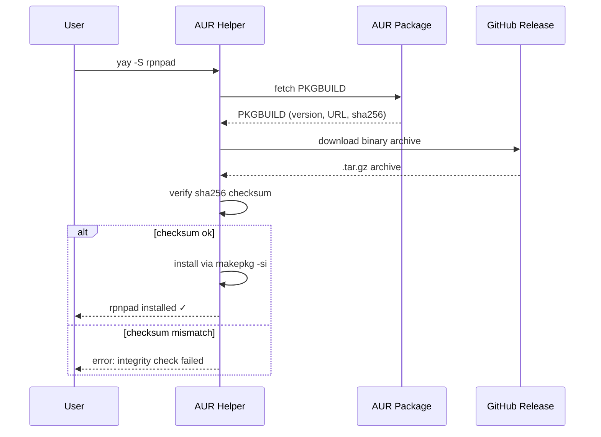

# Behaviour: User installs rpnpad via AUR

## Actor
CLI power user (Arch Linux or Arch-based distro — Manjaro, EndeavourOS, etc.)

## Preconditions
- User is running Arch Linux or an Arch-based distribution
- An AUR helper (yay, paru, or equivalent) is installed
- A published `rpnpad` AUR package exists (PKGBUILD maintained by the maintainer)
- A GitHub Release exists with pre-built binaries and SHA-256 checksums

## Main Flow
1. User runs `yay -S rpnpad` (or `paru -S rpnpad`).
2. AUR helper fetches the `PKGBUILD` from the AUR package page.
3. AUR helper downloads the pre-built binary archive for the user's architecture
   from the GitHub Release URL specified in the PKGBUILD.
4. AUR helper verifies the archive's SHA-256 checksum against the value in the PKGBUILD.
5. AUR helper installs the binary to `/usr/bin/rpnpad` and registers it with pacman.
6. User runs `rpnpad` and the calculator starts.

## Alternate Flows

### Upgrading an existing installation
- **Trigger:** User has a previous version installed and a newer AUR package version exists
- **Steps:**
  1. User runs `yay -Syu` (system upgrade) or `yay -S rpnpad` explicitly.
  2. AUR helper detects a newer PKGBUILD version.
  3. AUR helper downloads and installs the new binary.
- **Outcome:** New version is on PATH; old version replaced.

### Manual install without AUR helper
- **Trigger:** User prefers not to use an AUR helper
- **Steps:**
  1. User clones the AUR package: `git clone https://aur.archlinux.org/rpnpad.git`
  2. User enters the directory and runs `makepkg -si`.
  3. makepkg downloads the binary from GitHub Release, verifies the checksum, and installs.
- **Outcome:** rpnpad installed via pacman, same result as AUR helper flow.

### Architecture not in PKGBUILD
- **Trigger:** User is on an architecture not listed in the PKGBUILD `arch` array (e.g. ARM)
- **Steps:**
  1. makepkg or AUR helper refuses to build for unsupported architecture.
- **Outcome:** Installation fails with a clear architecture error; user falls back to `cargo install rpnpad`.

## Postconditions
- `rpnpad` is available on the user's PATH at `/usr/bin/rpnpad`
- pacman tracks the installation; `pacman -Q rpnpad` reports the installed version
- Future `yay -Syu` will upgrade rpnpad when new AUR package versions are published

## Error Conditions
- **AUR package not found** (`yay -S rpnpad` returns "error: target not found"): package has not been submitted or was deleted from AUR; user falls back to `curl` installer or `cargo install`.
- **Checksum mismatch** (PKGBUILD sha256sum does not match downloaded archive): makepkg aborts with "integrity check failed"; indicates a corrupt download or stale PKGBUILD. User retries or reports to maintainer.
- **GitHub Release asset missing** (binary URL in PKGBUILD returns 404): makepkg aborts with a download error; maintainer must update the PKGBUILD to point to the correct release asset URL.
- **PKGBUILD out of date** (AUR package version lags behind latest GitHub Release): user installs an older version; maintainer must update the AUR package. User can work around with `cargo install rpnpad` for the latest.

## Flow

## Related
- `../cargo-dist-release-pipeline/usecase.md` — upstream; produces the binary archives and GitHub Release that the PKGBUILD references
- `../install-via-curl/usecase.md` — sibling; fallback install path for non-Arch Linux users or when AUR package is unavailable
- `../install-via-homebrew/usecase.md` — sibling; equivalent pattern for macOS users

## Acceptance Criteria

**AC-1: Fresh install places rpnpad on PATH**
- Given an AUR helper is installed and the `rpnpad` AUR package exists
- When the user runs `yay -S rpnpad`
- Then rpnpad is installed to `/usr/bin/rpnpad`, available on PATH without a shell restart, and tracked by pacman

**AC-2: Upgrade installs new version**
- Given rpnpad is already installed via AUR and a newer AUR package version exists
- When the user runs `yay -Syu` or `yay -S rpnpad`
- Then the new version is installed and `pacman -Q rpnpad` reports the updated version

**AC-3: Manual install via makepkg succeeds**
- Given the user has cloned the AUR package repository
- When the user runs `makepkg -si` in the package directory
- Then rpnpad is installed identically to the AUR helper flow

**AC-4: Checksum mismatch aborts installation**
- Given the downloaded archive does not match the PKGBUILD sha256sum
- When makepkg verifies the checksum
- Then makepkg aborts with an integrity check error and no binary is installed

**AC-5: Unsupported architecture gives actionable error**
- Given the user's architecture is not listed in the PKGBUILD `arch` array
- When the user attempts to install
- Then the AUR helper or makepkg reports an architecture error and the installation does not proceed

**AC-6: AUR package not found gives actionable error**
- Given the `rpnpad` AUR package does not exist
- When the user runs `yay -S rpnpad`
- Then the AUR helper reports "target not found" and the user is not left with a broken state

## Implementations <!-- taproot-managed -->
- [PKGBUILD](./pkgbuild/impl.md)

## Status
- **State:** implemented
- **Created:** 2026-03-25
- **Last reviewed:** 2026-03-25

## Notes
- The PKGBUILD pulls pre-built binaries from GitHub Release — it does not compile from source. This keeps install time fast and avoids requiring a Rust toolchain on the user's machine. A separate `-bin` suffix (e.g. `rpnpad-bin`) is conventional for binary AUR packages; whether to use the plain `rpnpad` name or `rpnpad-bin` is a naming decision for the maintainer when submitting.
- AUR package maintenance is a separate concern from this behaviour: the maintainer must update the PKGBUILD's `pkgver`, `sha256sums`, and source URL on each release. This can be partially automated via CI.
- x86_64 is the only Linux target currently built by cargo-dist. If aarch64-unknown-linux-gnu is added to targets in Cargo.toml, the PKGBUILD can be updated to support ARM Arch installations.
