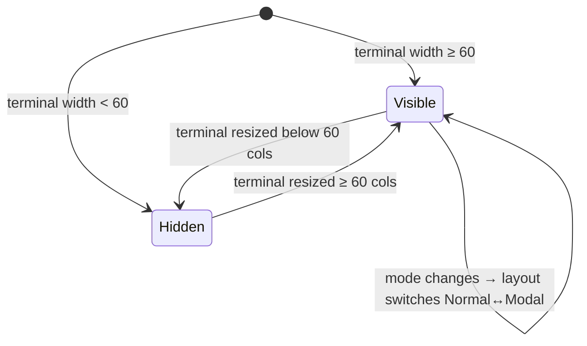

# UseCase: User browses the hints pane to find an operation

## Actor
User (CLI power user)

## Preconditions
- rpnpad is running with terminal width ≥60 columns (hints pane visible)

## Main Flow
1. User glances at the hints pane — no explicit action required
2. Pane displays a categorised grid of available operations and their keys,
   filtered to the current stack depth:
   - Empty stack: push hints and constants
   - 1 item: adds unary operation hints
   - 2+ items: highlights binary operation hints
   When the user is in a typed-input mode (e.g. Insert, Alpha, ConvertInput),
   the grid is replaced by a compact modal layout showing only the keys
   available in that mode.
3. Session-level commands (e.g. `Q quit`) appear in a dedicated **SESSION**
   section, visually separated from stack and arithmetic operations
4. User identifies the key (or chord) for the desired operation and presses it

## Alternate Flows
- **Registers exist**: a register section appears at the bottom of the pane
  showing defined register names and their `RCL` commands
- **Terminal width 60–79 cols**: hints pane narrows; labels may abbreviate
- **Terminal width <60 cols**: hints pane collapses entirely; user must know
  keybindings from memory
- **Modal typed-input hints**: When the mode requires typed input (Insert,
  InsertUnit, Alpha, AlphaStore, ConvertInput, PrecisionInput, Browse),
  the hints pane replaces the operation grid with a compact modal layout:
  a mode header, followed by Enter/Esc/Backspace key table, and any
  mode-specific guidance (e.g. unit syntax in Insert, unit reference in
  ConvertInput). The grid and chord leaders are hidden.
- **UNITS section (Normal mode)**: When the stack top is a unit-tagged value,
  a UNITS section appears after the chord leaders showing `U  convert`. It is
  absent when the stack top is plain or the stack is empty.
  (Detailed acceptance criteria are in unit-aware-values AC-24.)

## Error Conditions
- None — hints pane is read-only and purely functional

## Postconditions
- User has identified and executed the desired operation
- Hints pane updates immediately to reflect the new stack state

## Flow

## Acceptance Criteria
**AC-1:** Given terminal width ≥60 columns and an empty stack, when the hints pane renders, then push hints and constants are shown.

**AC-2:** Given terminal width ≥60 columns and stack depth ≥2, when the hints pane renders, then binary operation hints are highlighted.

**AC-3:** Given named registers exist, when the hints pane renders, then a register section appears showing each register name and its RCL command.

**AC-4:** Given terminal width <60 columns, then the hints pane collapses entirely and no hints are shown.

**AC-5:** Given Normal mode, when the hints pane renders, then `Q quit` appears in a SESSION section that is visually distinct from the STACK section — not grouped with stack manipulation operations (swap, drop, dup, rotate, undo, yank, store).

**AC-6:** Given the user is in ConvertInput mode, when the hints pane renders, then the normal operation grid is replaced by a `CONVERT TO UNIT` header, followed by Enter/Esc/Backspace key table, followed by the compatible unit reference for the stack top's category (or a COMPOUND UNIT section for compound units).

**AC-7:** Given the user is in Insert mode, when the hints pane renders, then a unit syntax hint line is shown (e.g. `unit: 1.9 oz  6 ft  98.6 F`).

**AC-8:** Given Normal mode and a unit-tagged value at the stack top, when the hints pane renders, then a UNITS section appears with `U  convert`. Given Normal mode and a plain or absent stack top, the UNITS section is absent.

**AC-9: PrecisionInput mode shows modal hints**
- Given the user is in PrecisionInput mode (`[PREC]` sub-mode, entered via `C›p`)
- When the hints pane renders
- Then the normal operation grid is replaced by a modal layout showing: a `PRECISION INPUT` mode header, a key table listing `Enter` (confirm), `Esc` (cancel), `Backspace` (delete digit), and a note indicating valid range (`1–15`); no chord leaders are shown

## Related
- **Sibling**: [User executes an operation via chord sequence](../execute-chord-operation/usecase.md)
- **Parent intent**: [Discoverability](../../intent.md)
- **Cross-ref**: [unit-aware-values AC-23, AC-24, AC-25](../../physical-quantities/unit-aware-values/usecase.md) — detailed ACs for unit-specific hint content

## Implementations <!-- taproot-managed -->
- [Browse Hints Pane](./tui/impl.md)

## Status
- **State:** implemented
- **Created:** 2026-03-21
- **Last reviewed:** 2026-03-30
